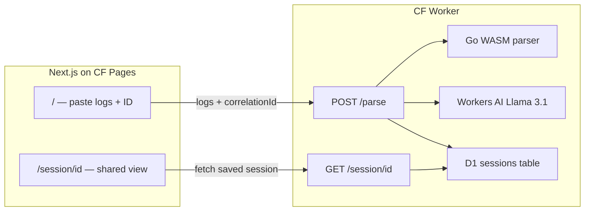

# Trace

Structured log explorer that reconstructs request narratives across services — no instrumentation required.

Paste raw structured JSON logs, enter a correlation/request ID, and get a swimlane timeline showing exactly what happened across every service — with durations between hops, a failure callout, and an LLM-generated incident summary.

## Architecture



| Layer | Tech |
|-------|------|
| Parser | Go 1.22 → WASM (TypeScript fallback in Worker when WASM unavailable) |
| API | Cloudflare Workers (TypeScript) |
| Storage | Cloudflare D1 (SQLite) |
| AI | Cloudflare Workers AI — Llama 3.1 8B Instruct |
| Frontend | Next.js 14, Tailwind CSS |
| Hosting | CF Pages (frontend) + CF Workers (API) |

## Project structure

```
trace/
  parser/          # Go WASM log parser
  worker/          # Cloudflare Worker API
  frontend/        # Next.js swimlane UI
  test_logs/       # Sample log files for demos
```

## Supported log field conventions

Trace infers schema automatically. These field names are recognized (in priority order):

| Role | Recognized field names |
|------|------------------------|
| Correlation ID | `request_id`, `requestId`, `req_id`, `reqId`, `trace_id`, `traceId`, `correlation_id`, `correlationId`, `X-Request-ID`, `transaction_id`, `span_id` |
| Timestamp | `timestamp`, `time`, `ts`, `@timestamp`, `created_at`, `datetime`, `logged_at`, `event_time` |
| Service name | `service`, `service_name`, `serviceName`, `app`, `application`, `component`, `logger`, `source` |
| Message | `msg`, `message`, `log`, `text` |
| Level | `level`, `severity`, `log_level` |
| Status code | `status`, `status_code`, `statusCode`, `http_status` |
| Latency | `latency_ms`, `latency`, `duration_ms`, `response_time` |

Timestamps support ISO8601, Unix seconds, Unix milliseconds, and `YYYY/MM/DD HH:MM:SS`.

## Clock skew handling

When logs come from multiple services with unsynchronized clocks, Trace applies a conservative adjustment:

1. Services are ordered by their first event timestamp.
2. If service B's first event is more than 100ms **before** service A's last event, all of B's events are shifted forward by `gap + 1ms`.
3. This assumes causal ordering — a downstream service cannot receive a request before the upstream service sends it.

## LLM validation

The Workers AI narrative is validated before display:

- Every service name mentioned in the summary must exist in the timeline (prevents hallucinated services).
- If the summary claims failure, a `failurePoint` must exist in the timeline.
- If validation fails or AI is unavailable, a deterministic template fallback is used instead.

## Local development

### Prerequisites

- Go 1.22+
- Node.js 18+
- Wrangler 3.99+

### 1. Build Go WASM

```bash
cd parser
chmod +x build.sh
./build.sh
```

This compiles `main.wasm` and copies `wasm_exec.js` into `worker/src/`.

> **Note:** Go's `syscall/js` WASM requires a JS runtime bridge. Local `wrangler dev` may fall back to the bundled TypeScript parser (identical logic). The Worker tries WASM first, then TS. Production Workers may also use the TS fallback depending on runtime constraints.

### 2. Set up Worker

```bash
cd worker
npm install

# Create D1 database (first time only)
wrangler d1 create trace-sessions
# Copy the database_id into wrangler.toml

# Run migration locally
npm run db:migrate:local

# Start Worker dev server
npm run dev
# → http://localhost:8787
```

### 3. Start frontend

```bash
cd frontend
npm install
cp .env.local.example .env.local
npm run dev
# → http://localhost:3000
```

### Demo

1. Open `http://localhost:3000`
2. Paste contents of `test_logs/mixed_services_sample.json`
3. Enter correlation ID `abc-123`
4. Click **Parse & Build Timeline**
5. See 3-lane swimlane with failure at order-service, yellow last-success marker, and incident summary

## Deploy

```bash
# 1. Build WASM
cd parser && ./build.sh

# 2. Create D1 database (if not done)
wrangler d1 create trace-sessions
# Update database_id in worker/wrangler.toml

# 3. Run D1 migration on remote
cd worker
wrangler d1 execute trace-sessions --remote --file=./migrations/0001_create_sessions.sql

# 4. Deploy Worker
wrangler deploy

# 5. Deploy frontend
cd ../frontend
npm run build
npx wrangler pages deploy out
```

Set environment variables on Cloudflare Pages:

- `NEXT_PUBLIC_WORKER_URL` — your Worker URL (e.g. `https://trace-worker.your-subdomain.workers.dev`)
- `NEXT_PUBLIC_APP_URL` — your Pages URL (e.g. `https://trace.pages.dev`)

## Test logs

| File | Correlation ID to try | Notes |
|------|----------------------|-------|
| `mixed_services_sample.json` | `abc-123` | Main demo — 3 services, mixed field names, DB timeout failure |
| `express_sample.json` | `exp-002` | Winston-style fields, payment timeout |
| `fastapi_sample.json` | `fast-200` | Python logger fields, inventory failure |
| `rails_sample.json` | `rails-bb2` | Rails/Sidekiq, SMTP failure |
| `go_stdlib_sample.json` | `go-trace-02` | slog JSON, card declined |

## What Trace does NOT do

- Real-time log streaming
- SDK/agent instrumentation
- User accounts or persistent history beyond D1 sessions
- Binary log formats (JSON only)
- LLM chat over logs
- Multiple correlation ID search in one query
