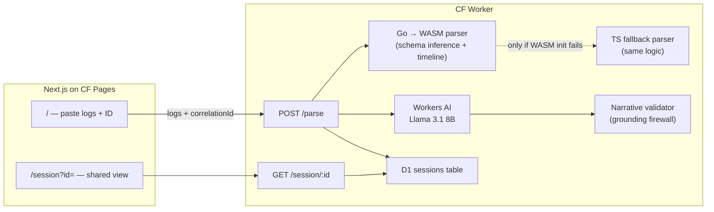

# Trace

Structured log explorer that reconstructs request narratives across services — no instrumentation required.

Paste raw structured JSON logs (a JSON array **or** NDJSON — one object per line), enter a correlation/request ID, and get a swimlane timeline showing exactly what happened across every service — with the failure point, the last success before it, clock-skew detection, and an LLM-generated incident summary that is validated against the timeline before it is shown.

## Architecture



| Layer | Tech |
|-------|------|
| Parser | Go 1.22+ → WASM via `CompiledWasm` module rule (TypeScript fallback with identical logic) |
| API | Cloudflare Workers (TypeScript) |
| Storage | Cloudflare D1 (SQLite) |
| AI | Cloudflare Workers AI — `@cf/meta/llama-3.1-8b-instruct-fast` (the base 8B model was deprecated 2026-05-30), output validated before display |
| Frontend | Next.js 14 static export, Tailwind CSS |
| Hosting | CF Pages (frontend) + CF Workers (API) |

Every `/parse` response carries an `x-trace-engine: wasm | ts` header so you can verify which engine served it.

## Measured performance

All numbers from real runs (2026-07-06, Apple M4 Pro; Worker numbers measured against `wrangler dev`, i.e. the real workerd runtime):

| Metric | Result |
|--------|--------|
| 10,000-line NDJSON dump (1.35 MB, 5 services, mixed conventions) through `POST /parse` on the **WASM engine** | **median 426 ms end-to-end** (5 runs: 417/441/426/428/400) — includes schema inference, timeline build, and D1 session write |
| Native Go pipeline (inference + parse + timeline, same 10k entries) — `go test -bench BenchmarkFullPipeline10k` | **~23 ms/op** |
| WASM binary | 4.0 MB raw, **1.11 MB gzipped** (fits the 3 MB compressed Workers limit) |
| Schema inference accuracy across the 6 sample formats (`TestInferenceAccuracy`, 5 roles × 6 formats) | **30/30 roles correct** |
| Narrative validator: deliberately hallucinated summaries rejected | **10/10** |
| Narrative validator: fallback template validated against its own rules on all sample timelines | **34/34 pass** |

### Live edge (deployed to Cloudflare, measured 2026-07-06)

Worker: `https://trace-worker.nayyirahsan.workers.dev` · Frontend: `https://trace-nayyir.pages.dev`

| Metric | Result |
|--------|--------|
| Requests served by the Go WASM engine in production (`x-trace-engine` header) | **34/34** |
| Live Workers AI (`@cf/meta/llama-3.1-8b-instruct-fast`) summaries passing the grounding validator | **34/34 accepted, 0 template fallbacks** |
| Delivered summaries failing independent local re-validation (i.e. hallucinated services/numbers reaching users) | **0/34** |
| Sample-timeline `POST /parse` on the edge, including the live AI call | min 205 ms · **median 391 ms** · max 732 ms |
| 10,000-line dump (1.35 MB upload) through the production edge, incl. live AI + D1 write | median **1.53 s** end-to-end (5 runs) |
| Production D1 session round-trip (`POST /parse` → `GET /session/:id`) | identical timeline + narrative returned |

## Schema inference

Zero configuration. For each semantic role (correlation ID, timestamp, service, message, level, status, latency) the parser scores every field in the dump:

- **Exact candidates** (`request_id`, `@timestamp`, …) score by priority position.
- **Fuzzy name signals** catch non-standard spellings — `ts-unix-ms`, `http_request_id`, `eventTime` — via token splitting on separators and camelCase.
- **Value shape** adds confidence (UUID-ish IDs, parseable timestamps, 100–599 status codes), but a field is never selected on value shape alone — that keeps random high-cardinality fields from being mistaken for correlation IDs.
- **All plausible fields become per-role aliases**, so a single dump that mixes `request_id` / `req_id` / `traceId` (or epoch-ms / ISO8601 / epoch-seconds timestamps) resolves correctly per entry. This is tested by `test_logs/ndjson_mixed_conventions.ndjson`, which uses three conventions in one file.

Recognized names (exact list in `parser/parser/infer.go`):

| Role | Exact candidates | Fuzzy signals |
|------|------------------|---------------|
| Correlation ID | `request_id`, `requestId`, `req_id`, `reqId`, `trace_id`, `traceId`, `correlation_id`, `correlationId`, `X-Request-ID`, `transaction_id`, `span_id` | any name containing `requestid`, `traceid`, `corrid`, `txnid`, `spanid`, `operationid` (separators ignored) |
| Timestamp | `timestamp`, `time`, `ts`, `@timestamp`, `created_at`, `datetime`, `logged_at`, `event_time` | tokens `timestamp`, `time`, `ts`, `date`, `datetime`, `stamp` |
| Service | `service`, `service_name`, `serviceName`, `app`, `application`, `component`, `logger`, `source` | tokens incl. `svc`, `module` |
| Message | `msg`, `message`, `log`, `text` | same as tokens |
| Level | `level`, `severity`, `log_level` | token `lvl` |
| Status code | `status`, `status_code`, `statusCode`, `http_status` | `statuscode`, `httpstatus` |
| Latency | `latency_ms`, `latency`, `duration_ms`, `response_time` | tokens `duration`, `elapsed`, `took` |

Timestamp formats: RFC3339/ISO8601 (with or without sub-seconds/zone), `YYYY-MM-DD HH:MM:SS[,.]mmm` (Python logging), `YYYY/MM/DD HH:MM:SS`, Unix seconds (fractional ok), milliseconds, and microseconds.

Robustness (all covered by tests):

- **NDJSON and truncated array pastes** are recovered line by line; unparseable lines are skipped and counted (`stats.malformedLines`), never fatal.
- **Entries without a timestamp** are dropped and counted (`stats.missingTimestamp`).
- **Entries without a correlation ID** are kept out of every timeline and counted; an empty correlation ID never matches anything.

## Clock skew: detect, don't rewrite

The previous approach (shifting any service whose first event overlapped the previous lane) was wrong: an entry-point service spans the whole request, so every normally interleaved downstream service "overlaps" it. Rewriting timestamps also falsifies incident evidence.

Trace now **detects** skew instead: a service lane whose entire activity window is disjoint from every other lane's window by more than 5 s is flagged with its estimated offset (e.g. `billing-service ~119.8s behind`). The UI shows a warning banner; timestamps are always displayed as logged. When only two lanes disagree, the more suspect one (fewer events, clock-behind) is flagged. Genuine skew correction requires causal instrumentation (trace spans), which contradicts the zero-instrumentation premise — so Trace is explicit about uncertainty rather than silently "fixing" data.

Try it: `test_logs/clock_skew_sample.json` with ID `pay-555`.

## Grounded LLM narration

The LLM never sees raw log text. It receives only the structured timeline context (service names, event counts, first/last event offsets, failure point, last success, suspected skew). Its output then passes a validator that rejects:

1. **Unknown identifiers** — any hyphen/underscore token that is not a real service name or the correlation ID.
2. **Unknown service phrases** — "the payment service" when no such service exists.
3. **Ungrounded numbers** — every number in the summary must appear in the context (event offsets, status codes, durations, counts, numbers inside logged messages), including unit checks: "5 seconds" is rejected unless 5000 ms is actually in the data, even if the bare number 5 appears elsewhere.
4. **Failure inconsistency** — summaries that invent a failure on a clean timeline, omit a real failure, or fail to name the failing service.

Rejected output is replaced by a deterministic template built purely from the timeline (the template itself passes the validator on all 34 sample timelines — see `worker/test/narrate.test.ts`). The result: a hallucinated service or metric cannot reach the user. The UI labels each summary `AI generated` or `Template fallback`.

## Project structure

```
trace/
  parser/          # Go parser: schema inference, timeline build, WASM entry
  worker/          # Cloudflare Worker API + TS fallback parser + validator
  frontend/        # Next.js swimlane UI (static export)
  test_logs/       # Sample dumps used by tests and the in-app demo buttons
```

## Local development

Prerequisites: Go 1.22+, Node 18+, Wrangler 3.99+.

```bash
# 1. Build the WASM parser (copies main.wasm + matching wasm_exec.js into worker/src/)
cd parser && ./build.sh

# 2. Worker
cd ../worker
npm install
npm run db:migrate:local
npm run dev            # → http://localhost:8787
npm test               # parser parity + narrative grounding tests
npm run typecheck

# 3. Frontend
cd ../frontend
npm install
cp .env.local.example .env.local
npm run dev            # → http://localhost:3000

# Go tests + benchmark
cd ../parser
go test ./parser/ -v
go test ./parser/ -bench BenchmarkFullPipeline10k -run XXX
```

Demo flow: open `localhost:3000`, click a **Try a sample** button (loads logs and the correlation ID), then **Parse & Build Timeline**. You should see the swimlane with green/red event markers, the amber last-success ring, the failure callout line, and the incident summary. **Share Timeline** copies a `/session?id=…` URL backed by D1.

Note: Workers AI calls are proxied to your Cloudflare account even in local dev. Model: `@cf/meta/llama-3.1-8b-instruct-fast` (the original `llama-3.1-8b-instruct` was deprecated 2026-05-30). Run `npm run batch:live-ai` in `worker/` to measure live acceptance.

## Deploy

**Already done on this account:**
- `wrangler login` ✓
- D1 `trace-sessions` created → `database_id = ac369f77-4db1-48c9-9880-59cf4c7fc7f2` in `worker/wrangler.toml`
- Remote migration applied ✓
- Worker bundle uploaded ✓

**One manual step left** — register a `workers.dev` subdomain (Wrangler cannot do this non-interactively). In your terminal:

```bash
cd worker
npx wrangler deploy
# When prompted: register workers.dev subdomain (e.g. trace → trace-worker.<you>.workers.dev)

cd ../frontend
npm run build
npx wrangler pages deploy out
```

Set on Cloudflare Pages: `NEXT_PUBLIC_WORKER_URL` (your workers.dev URL) and `NEXT_PUBLIC_APP_URL` (your pages.dev URL).

After deploying, verify the edge is running the Go engine:

```bash
curl -s -D - -o /dev/null -X POST https://<worker>/parse \
  -H 'Content-Type: application/json' \
  -d '{"logs":"[{\"request_id\":\"x-1\",\"ts\":1705316625000,\"service\":\"a\",\"msg\":\"hi\"}]","correlationId":"x-1"}' \
  | grep x-trace-engine        # → x-trace-engine: wasm
```

## Test logs

| File | ID to try | Notes |
|------|-----------|-------|
| `mixed_services_sample.json` | `abc-123` | Main demo — 3 services, `request_id`+`req_id`, epoch-ms+ISO8601, DB timeout failure; includes a no-timestamp and a no-ID entry |
| `ndjson_mixed_conventions.ndjson` | `ord-77f2` | NDJSON, three naming conventions in one dump, 2 malformed lines, RPC timeout |
| `clock_skew_sample.json` | `pay-555` | billing-service clock ~2 min behind — triggers the skew warning |
| `express_sample.json` | `exp-002` | Winston-style fields, payment timeout |
| `fastapi_sample.json` | `fast-200` | Python logger fields, inventory failure |
| `rails_sample.json` | `rails-bb2` | Rails/Sidekiq, SMTP failure |
| `go_stdlib_sample.json` | `go-trace-02` | slog JSON, card declined |

## What Trace does NOT do

- Real-time log streaming
- SDK/agent instrumentation
- User accounts or persistent history beyond D1 sessions
- Binary log formats (JSON only)
- LLM chat over logs
- Multiple correlation ID search in one query
- Automatic clock-skew *correction* (detection + warning only, by design — see above)
